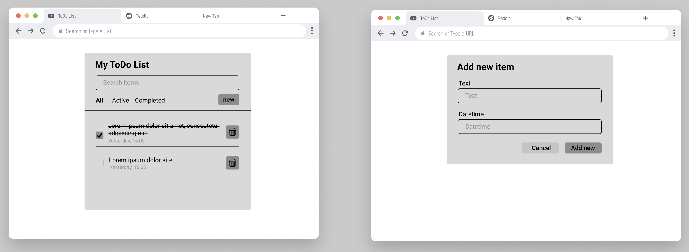
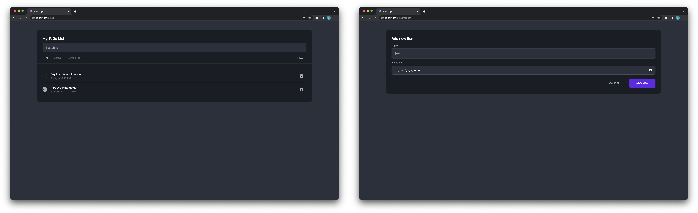

# ToDo App for amcef

**Used stack:**

- TailwindCSS + daisyUI
- vite ts-react
- ReactQuery
- mockapi
- formik

You can find deployed version here: https://magical-sundae-8c8af6.netlify.app/
Have a nice day ☀️

### How much it took me to finish this project?

- research before & during coding
  - daisyUI: 15min
  - vite ts-react: 15min
  - ReactQuery: 1h
  - mockapi: 20min
- figma design: 40min
- coding
  - screens (tailwindcss + daisyUI): 4h
  - logic: 4h
  - adding multiple todo list functionality: 4h

### Figma prototype

### Final product

